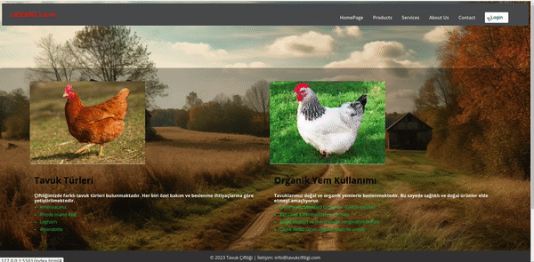

# UDEMİG Farm - Web Site with Login & Registration Form

This is a simple web project for UDEMİG Farm, a fictional farm, featuring a login and registration form. The project includes HTML, CSS, and JavaScript files.

## Table of Contents

- [Project Description](#project-description)
- [Features](#features)
- [Project Structure](#project-structure)
- [Installation](#installation)
- [Usage](#usage)
- [Contributing](#contributing)
- [Contact](#contact)

## Project Description

The UDEMİG Farm website is designed to showcase information about the farm, its products, services, and more. It includes a navigation bar, a section displaying information about different chicken breeds, and another section highlighting the use of organic feed.

The project also features a login and registration form, allowing users to connect with the farm.

## Features

- Responsive navigation bar with a hamburger menu.
- Sections describing chicken breeds and organic feed usage.
- Login and registration forms with a popup overlay.
- Close button functionality for the popup overlay.
- Basic form validation (HTML `required` attribute).

## Project Structure

- `index.html`: The main HTML file containing the structure of the website.
- `style.css`: The CSS file for styling the HTML elements.
- `script.js`: The JavaScript file for handling form popups and other interactions.
- `images/`: A directory containing images used in the project.

## Usage

- Explore different sections of the website through the navigation bar.
- Click on the "Login" button to open the login form popup.
- Click on the "Signup" link to switch to the registration form.
- Close the form popup using the "close" button or the overlay.

## Contributing

Contributions are welcome! Feel free to open issues or submit pull requests.

## Contact
For inquiries, contact us at fmkaragoz@gmail.com

## SCREENSHOT

